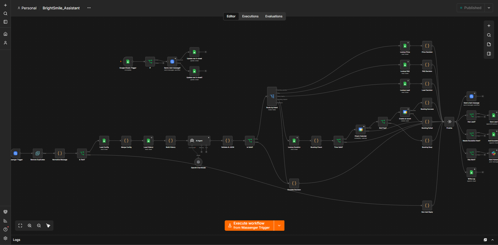
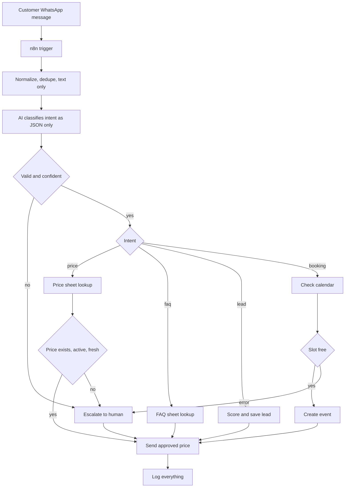

# WhatsApp Lead Qualification Assistant

> A WhatsApp assistant that **refuses to guess**. The AI only classifies messages.
> Approved data decides every price, hour and answer, and every failure ends with a human.

**▶ [60-second demo](YOUR_LOOM_LINK)**

> **Project.** BrightSmile is a fictional dental clinic. All prices, policies and data are invented.

## The problem
Chatbots guess. An invented price or a double-booked slot costs real money and trust.
This project shows how to build a WhatsApp agent that gives right answers from the supllied data every time.

## What it does
- Answers prices and FAQs **only** from approved Google Sheets
- Qualifies leads across messages (service, timeline, name), scores them, saves them to a CRM sheet
- Books appointments in Google Calendar, and **confirms only after the event exists**
- Escalates to a human (Slack) and records every case; when the human answers, the customer receives it
- Logs every message, action and error

## Design rules
1. **The AI only classifies.** It never writes a price, policy or fact.
2. A price is quoted only if the row exists, is active, has a value and was updated within 30 days.
3. FAQ answers are sent word for word from the sheet.
4. A booking is never confirmed until the calendar returns an event ID.
5. Every failure path ends with a human being alerted. Nothing is invented.

## Failure handling you can see
| Scenario | What the customer sees | What happens behind the scenes |
|---|---|---|
| Price missing (premium package) | "A team member will confirm" | Escalation row + Slack alert |
| Price stale (older than 30 days) | Same | Same, reason `stale_price` |
| Calendar API fails | "I haven't booked anything yet" | Error logged + Slack alert |
| AI returns invalid JSON | Holding message | Escalated to human |
| Emergency wording (swelling, bleeding) | Safety guidance | Urgent Slack alert, overrides the AI classification |
| Prompt injection ("ignore your rules") | Holding message | Classified as other, human notified |

## Architecture

## Stack
n8n · OpenAI · Google Sheets (data + CRM) · Google Calendar · Slack · WhatsApp gateway (Wassenger)

## Quick start
1. Import `data/BrightSmile_Demo_Data.xlsx` into Google Sheets.
2. Import the files in `workflows/` into n8n and connect your own credentials.
3. Replace the `YOUR_...` placeholders (sheet, calendar, Slack channel, device).
4. Send the test messages in [`docs/test-cases.md`](docs/test-cases.md).

Full steps: [`docs/setup.md`](docs/setup.md)

## Honest limitations
- Built on a WhatsApp gateway for demo purposes; a production launch needs an approved business number and message templates.
- Handles one question per message; a classifier with short history is a possible next step.
- Google Sheets is fine for a demo but would be a database in production.

## Roadmap
Short conversation history · multi-language replies · Postgres instead of Sheets · analytics dashboard

## License
MIT. Built by Ifedayo 'Max' Fakayode. Open to remote AI automation work: [\[LinkedIn link\]](https://www.linkedin.com/in/ifedayofakayode/)
